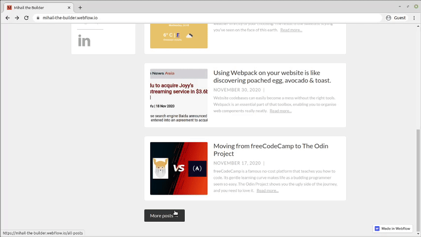
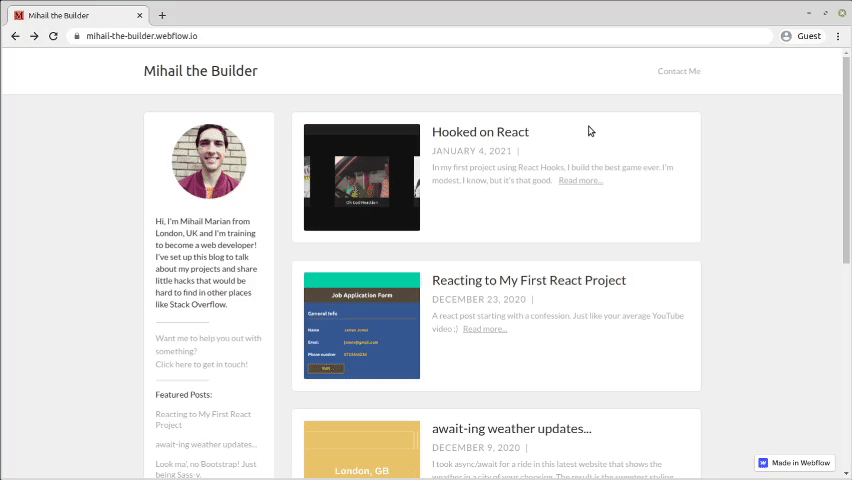

# Personal Blog in Webflow

A personal blog site built with [Webflow's CMS plan](https://webflow.com/pricing#site). Link to [live site](https://mihail-the-builder.webflow.io/).

**Note:** This repo only contains a description of the project. [Click here](https://preview.webflow.com/preview/mihail-the-builder?utm_medium=preview_link&utm_source=dashboard&utm_content=mihail-the-builder&preview=8b4bb73ca7c3c8348a018072273cd1b8&mode=preview) if you'd like to copy the project in Webflow.

# How it works

The landing page renders the first 5 blog posts I have published. For each of them, I show a title, publication date, headline and a `Read More` link.

Clicking the `Read More` link redirects the user to the article's page. There's a range of content placed inside the articles, such as:
- links to websites and GitHub repos at the top
- GIFs
- YouTube videos demonstrating certain points
- code snippents

There's a `More Posts` button at the bottom of the landing page. When you click it, you'll be redirected to another page that has all of the articles. This page looks nearly identical to the previous one.

Last but not least, the website has a `Contact Me` page with a simple form:

